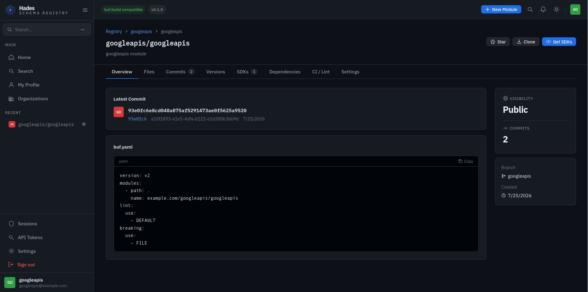
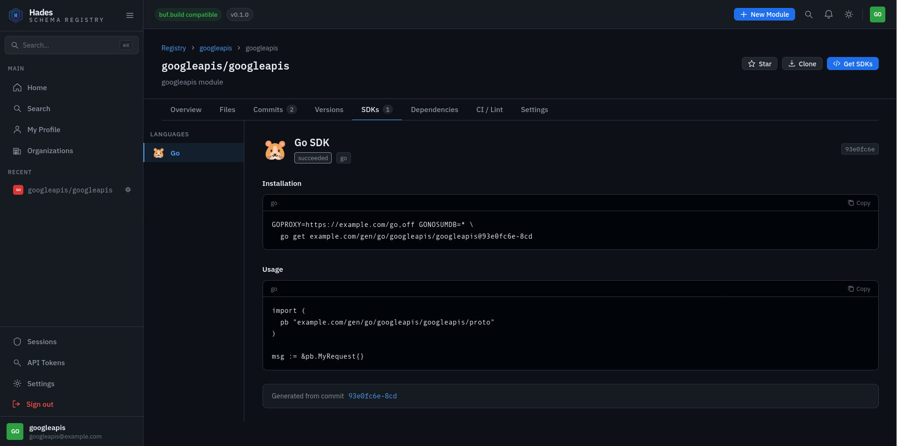

# Hades

An open-source [Buf](https://github.com/bufbuild/buf)-compatible schema registry for managing and versioning Protocol Buffer definitions.

<table width="100%">
  <tr>
    <td width="50%" align="center">
      
      <br/><sub><b>Module Overview</b> (latest commit, buf.yaml and visibility)</sub>
    </td>
    <td width="50%" align="center">
      
      <br/><sub><b>Generated SDKs</b> (per-language install commands with version selector)</sub>
    </td>
  </tr>
</table>

<video src="https://github.com/user-attachments/assets/a9758133-1611-4e75-b801-a9b55e341319" autoplay loop muted playsinline width="100%"></video>
<p align="center"><sub><b>buf push → commit visible in registry</b></sub></p>

## Quickstart

**Run with no external dependencies (SQLite + local filesystem):**

```bash
go run ./cmd/hades serve --config config/dev.yaml
```

The default `config/dev.yaml` uses SQLite for metadata and local disk for git and artifacts. No Docker required.

**Run with Postgres:**

```bash
docker compose -f development/docker-compose-minimal.yaml up -d
make migrate-up
go run ./cmd/hades serve --config config/dev.yaml
```

See [DEVELOPMENT.md](DEVELOPMENT.md) for the full development guide.

## Storage tools

Storage backends are configurable and swappable:

| Layer | Default | Alternatives |
|---|---|---|
| Metadata | SQLite | PostgreSQL |
| Git | go-git (local) | Gitaly |
| Artifacts | Local disk | Gitaly / S3 / MinIO |
| Cache | In-memory | Redis |

## Using the Buf CLI

```bash
# Authenticate (writes to ~/.netrc)
buf registry login your.domain.com

# Push a module
buf push

# Resolve dependencies from your registry
buf dep update

# Generate code
buf generate
```

See `development/protos/simpleproject` for a working example.

## Documentation

- [DEVELOPMENT.md](DEVELOPMENT.md): local setup, SQLite vs Postgres, testing, config reference
- [DEPLOYMENT.md](DEPLOYMENT.md): production deployment, TLS, Gitaly, S3, observability

## Contributing

Hades is in active development. Architecture is intentional and improving. If you spot a better approach, open an issue or PR. Contributions are welcome.

## License

Apache 2.0. See [LICENSE](LICENSE).
